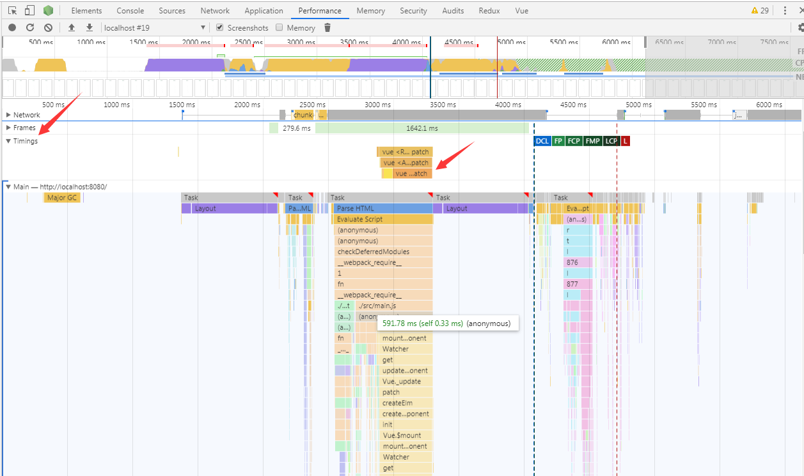
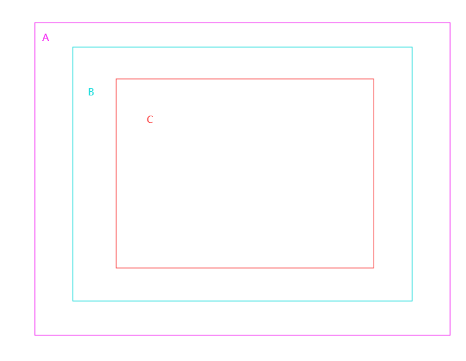
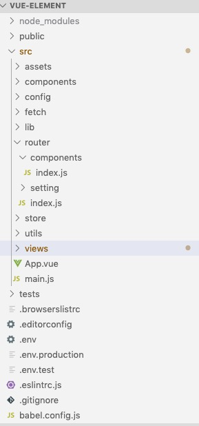

### 一键生成.vue文件模板

我们借用vscode自带的功能

```js
文件 -> 首选项 -> 用户代码片段 -> 点击新建代码片段 -> 取名vue.json 确定
```

编辑自己写的.vue模板，进行保存

```json
{
  "Print to console": {
    "prefix": "vue",
    "body": [
      "<!-- $0 -->",
      "<template>",
      "  <div></div>",
      "</template>",
      "",
      "<script>",
      "export default {",
      "  components: {},",
      "",
      "  data () {",
      "    return {",
      "    }",
      "  },",
      "",
      "  computed: {},",
      "",
      "  created () {},",
      "",
      "  methods: {}",
      "}",
      "",
      "</script>",
      "<style lang='scss' scoped>",
      "",
      "</style>"
  ],
    "description": "Log output to console"
  }
}
```

我们新建.vue文件，在首行输入vue按键盘Enter就可以了


### 重置data或者获取data初始值

在某些情况我们可能要重置data上面的某些属性

```javascript
this.$data //获取当前状态的data
this.$options.data() //获取该组件初始化状态下的data
Object.assign(this.$data,this.$options.data()) //重置data
```


###  强制刷新组件

```javascript
this.$forceUpdate() //迫使 Vue 实例重新渲染。注意它仅仅影响实例本身和插入插槽内容的子组件，而不是所有子组件。

/*
  强制替换元素/组件而不是重复使用它。当你遇到如下场景时它可能会很有用：
  完整地触发组件的生命周期钩子
  触发过渡
*/
<Component :key="key"/>
data(){
  return{
      key:0
  }
}
//刷新key达到刷新组件的目的
key++;
```


### performance[文档](https://cn.vuejs.org/v2/api/#performance)

进行组件初始化、编译、渲染和打补丁的性能追踪

```javascript
//main.js
const isDev = process.env.NODE_ENV !== "production";
Vue.config.performance = isDev;
```




### 长列表优化

当我们遇到很多的数据展示且不需要响应式变化时，我们就可以使用[Object.freeze](https://developer.mozilla.org/zh-CN/docs/Web/JavaScript/Reference/Global_Objects/Object/freeze)进行优化；

**`Object.freeze()`** 方法可以**冻结**一个对象。一个被冻结的对象再也不能被修改；

当我们把一个对象传给实例的data，Vue会使用`Object.defineProperty`把这些属性响应式，使用了 [Object.freeze](https://developer.mozilla.org/zh-CN/docs/Web/JavaScript/Reference/Global_Objects/Object/freeze)之后，不仅可以减少 `observer` 的开销，还能减少不少内存开销，Vue有人提了相关[issue](https://github.com/vuejs/vue/issues/4384)

```javascript
export default {
  data(){
    return {
      list: []
    }
  },
  async created() {
    const list = await this.$axios.get("/goodsList");
    this.list = Object.freeze(list);
  }
};

```


### $attrs & $listeners

我们平时组件传值props跟emit用的比较多，但是有些时候他们不是父子组件就比较麻烦了

现在三个嵌套的组件, A -> B -> C  ,我们现在要从A传值给C, 或者C通过emit传值给A



A组件

```vue
<template>
  <div>
    <B :name="name" @changeName="changeName"/>
  </div>
</template>

<script>
import B from './B'
export default {
  components: {
    B
  },
  data () {
    return {
      name:'蜡笔小新'
    }
  },
  methods: {
    changeName(msg){
      this.name = msg
    }
  }
}
</script>

```

B组件

```vue
<template>
  <div>
    <C v-bind="$attrs" v-on="$listeners"/>
  </div>
</template>
<script>
import C from './C'
export default {
  components: {
    C
  },
}
</script>

```

C组件

```vue
<template>
  <div>
    {{name}}
    <button @click="changeName">修改</button>
  </div>
</template>
<script>
export default {
  props:{
    // A组件传来的
    name:{
      type:String
    }
  },
  methods: {
    changeName(){
      this.$emit('changeName','coder') //传给A组件
    }
  }
}
</script>

```

这样我们就实现了跨组件传值，一般在对UI组件进行二次封装时，只写上常用的一些属性跟方法，然后写上$attrs和$listners，我们使用组件时就可以直接使用原组件的属性跟方法


### .sync修饰符

因为vue带来的双向绑定给开发带来了便利，同时也带来了代码维护上的问题，我们可以在子组件直接修改父组件穿的prop，新版本直接修改会报warn,官方推荐以 `update:myPropName` 的模式触发事件取而代之

```vue
<text-document v-bind:title.sync="msg"></text-document>
//等同于
<text-document v-bind:title="value => msg = value"></text-document>

//子组件更新
this.$emit('update:title', newTitle)
```


### hook

这是一个文档中没有的api,在源码中存在的,我们可以看vue源码_init函数中是通过callHook调用生命周期的

```javascript
      vm._self = vm;
      initLifecycle(vm);
      initEvents(vm);
      initRender(vm);
      callHook(vm, 'beforeCreate');
      initInjections(vm); // resolve injections before data/props
      initState(vm);
      initProvide(vm); // resolve provide after data/props
      callHook(vm, 'created');
```

然后我们找到callHook，我们可以看到vm._hasHookEvent为true时就会执行 vm.$emit('hook:' + hook)

```javascript
 function callHook (vm, hook) {
    // #7573 disable dep collection when invoking lifecycle hooks
    pushTarget();
    var handlers = vm.$options[hook];
    var info = hook + " hook";
    if (handlers) {
      for (var i = 0, j = handlers.length; i < j; i++) {
        invokeWithErrorHandling(handlers[i], vm, null, vm, info);
      }
    }
    if (vm._hasHookEvent) {
      vm.$emit('hook:' + hook);
    }
    popTarget();
  }   
```

然后我们通过`_hasHookEven`t找到相关代码，当通过$on去监听时，如果事件名以 hooks: 作为前缀，vm._hasHookEvent就会被置为true

```javascript
    var hookRE = /^hook:/;
    Vue.prototype.$on = function (event, fn) {
      var vm = this;
      if (Array.isArray(event)) {
        for (var i = 0, l = event.length; i < l; i++) {
          vm.$on(event[i], fn);
        }
      } else {
        (vm._events[event] || (vm._events[event] = [])).push(fn);
        // optimize hook:event cost by using a boolean flag marked at registration
        // instead of a hash lookup
        if (hookRE.test(event)) {
          vm._hasHookEvent = true;
        }
      }
      return vm
    };
```

使用场景

```javascript
 mounted(){
    let i = 0
    this.timer = setInterval(()=>{
      console.log(++i);
    },1000)

    this.$on('hook:beforeDestroy',()=>{
        clearInterval(this.timer)
    })
  }
```


### 自定义组件的 `v-model` [文档](https://cn.vuejs.org/v2/guide/components-custom-events.html#自定义组件的-v-model)

一个组件上的 `v-model` 默认会利用名为 `value` 的 prop 和名为 `input` 的事件，但是像单选框、复选框等类型的输入控件可能会将 `value` 特性用于[不同的目的](https://developer.mozilla.org/en-US/docs/Web/HTML/Element/input/checkbox#Value)。`model` 选项可以用来避免这样的冲突：

```
Vue.component('base-checkbox', {
  model: {
    prop: 'checked',
    event: 'change'
  },
  props: {
    checked: Boolean
  },
  template: `
    <input
      type="checkbox"
      v-bind:checked="checked"
      v-on:change="$emit('change', $event.target.checked)"
    >
  `
})
```

```
<base-checkbox v-model="lovingVue"></base-checkbox>
```

这里的 `lovingVue` 的值将会传入这个名为 `checked` 的 prop。同时当 触发一个` change`事件并附带一个新的值的时候，这个 `lovingVue` 的属性将会被更新。


### 自动引入route文件

当我们项目比较大的时候，我们就会把路由文件根据不同的业务模块拆分



每个子模块导出一个路由配置数组

```javascript
export default [
  {
    path: '/home/welcome',
    name: 'home',
    component: () => import(/* webpackChunkName: "home" */ '@/pages/home/index.vue')
  }
]

```

我们现在要实现的是每增加一个模块自动引入，我们借用`webpack`的`api`[require.context](https://webpack.js.org/guides/dependency-management/#requirecontext)

```javascript
//router/index.js
import Vue from 'vue'
import Router from 'vue-router'
Vue.use(Router)
let routes = []
const routerContext = require.context('./', true, /index\.js$/)
routerContext.keys().forEach(route => {
  if (route.startsWith('./index')) return
  const routerMoudle = routerContext(route).default || routerContext(route)
  routes = [...routes, ...routerMoudle]
})

export default new Router({
  mode: 'history',
  base: process.env.BASE_URL,
  routes: routes
})

```


### 更新缓存的组件

使用vue的生命周期函数[activated](https://cn.vuejs.org/v2/api/#activated)

```js
 它在keep-alive 组件激活时调用。
 该钩子在服务器端渲染期间不被调用。
```


###  watch的高级用法

1.当我们watch一个值时，第一次不会执行，只有值发生变化时才会执行，此时需要我们将immediate设为true

2.普通的watch方法无法无法监听对象内部属性的改变，我们把deep设为true时就能进行深度监听了

```javascript
new Vue({
  el: '#app',
  data: {
    obj: { name: '蜡笔小新'}
  },
  watch: {
    obj: {
      handler(newName, oldName) {       },
      deep: true,
      immediate: true
    }
  } 
})

```


### 异步数据传值给子组件

这是新手都会遇到的问题，父组件异步获取数据传给子组件，子组件拿不到值，下面是我平时的解决方案

```js
在子组件使用watch监听prop
```

or

```javascript
在父组件的data上定义一个Boolean值为flag:false，在使用的子组件时写上v-if="flag",当异步数据获取到时，把flag改成true
```


### 巧用slot

插槽是一个很好用的api,特别是在封装组件的时候，让组件有更多扩展的空间

```html
//封装通用header组件
<template>
  <div class="cc-header header">
    <cc-svg-icon
      @click="goback"
      icon-class="left-arrow"
      class-name="left-arrow"
      size=".2rem"
    ></cc-svg-icon>
    <div v-if="$slots.center" class="cc-header-center">
      <slot name="center"></slot>
    </div>
    <p class="cc-header-title" v-else>{{title}}</p>
    <div class="cc-header-right">
      <slot name="right"></slot>
    </div>
  </div>
</template>
```

```html
//使用组件
<cc-header>
    <template slot="center">
        <van-search class="search-input" placeholder="通用名" v-model="params.search" />
    </template>
    <template slot="right">
        <div class="search-btn" @click="toSearch">搜索</div>
    </template>
 </cc-header>
```


### 开发插件

Vue.js 的插件应该暴露一个 `install` 方法。这个方法的第一个参数是 `Vue` 构造器，第二个参数是一个可选的选项对象：

```javascript
//MyPlugin.js
MyPlugin.install = function (Vue, options) {
  // 1. 添加全局方法或属性
  Vue.myGlobalMethod = function () {
    // 逻辑...
  }

  // 2. 添加全局资源
  Vue.directive('my-directive', {
    bind (el, binding, vnode, oldVnode) {
      // 逻辑...
    }
    ...
  })

  // 3. 注入组件选项
  Vue.mixin({
    created: function () {
      // 逻辑...
    }
    ...
  })

  // 4. 添加实例方法
  Vue.prototype.$myMethod = function (methodOptions) {
    // 逻辑...
  }
}
//main.js
Vue.use(MyPlugin)
```

然后在main.js引入， 通过全局方法 `Vue.use()` 使用插件,查看[vue文档](https://cn.vuejs.org/v2/guide/plugins.html)


### ref

`ref` 被用来给元素或子组件注册引用信息。引用信息将会注册在父组件的 `$refs` 对象上。如果在普通的 DOM 元素上使用，引用指向的就是 DOM 元素；如果用在子组件上，引用就指向组件实例

在操作dom的时候尽量使用ref去获取，因为它只作用于当前组件，而不是使用queryselector等全局选择器造成意外的bug

```html
<p ref="p">hello</p> 
<child-component ref="child"></child-component>
```


### 一些不常用却很牛逼的api

##### [Vue.observable( object )](https://cn.vuejs.org/v2/api/#Vue-observable)

让一个对象可响应。Vue 内部会用它来处理 `data` 函数返回的对象。当我们项目没使用vuex时，就可以使用这个api

```javascript
import Vue from 'vue'
export const store = Vue.observable({ count: 0 })
export const mutations = {
  setCount (count) {
    store.count = count
  }
}

```

##### [v-pre](https://cn.vuejs.org/v2/api/#v-pre)

跳过这个元素和它的子元素的编译过程。可以用来显示原始 Mustache 标签。跳过大量没有指令的节点会加快编译。

```vue
<span v-pre>{{ this will not be compiled }}</span>
```

##### [v-cloak](https://cn.vuejs.org/v2/api/#v-cloak)

这个指令保持在元素上直到关联实例结束编译。和 CSS 规则如 `[v-cloak] { display: none }` 一起用时，这个指令可以隐藏未编译的 Mustache 标签直到实例准备完毕。

当网络较慢，网页还在加载 Vue.js ，而导致 Vue 来不及渲染，这时页面就会显示原始 Mustache 标签。我们可以使用 v-cloak 指令来解决这一问题。

```html
<div v-cloak>
  {{ message }}
</div>
```

```css
[v-cloak] {
  display: none;
}

```

##### [v-once](https://cn.vuejs.org/v2/api/#v-once)

只渲染元素和组件一次。随后的重新渲染，元素/组件及其所有的子节点将被视为静态内容并跳过。这可以用于优化更新性能

```html
<span v-once>This will never change: {{msg}}</span>
```

